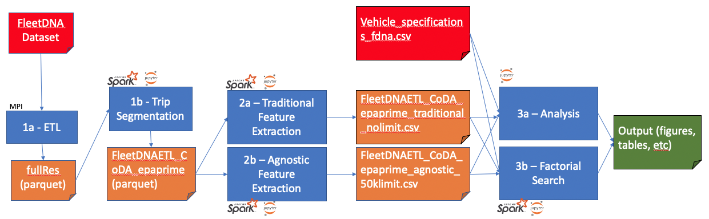

# Code Artifact for: Clustering Analysis of Commercial Vehicles Using Automatically Extracted Features from Time Series Data

Publication:

- NREL Publication: NREL/TP-2C00-74212
- DOI: https://doi.org/10.2172/1597242

Software Artifact:

- NREL Software Record: NREL/SWR-21-96

Datasets:

- “Fleet DNA Project Data.” (2017). National Renewable Energy Laboratory. Accessed [2017]: www.nrel.gov/fleetdna

Authors:
- Jordan Perr-Sauer <jordan.perr-sauer@nrel.gov>
- Caleb Phillips <caleb.phillips@nrel.gov>
- Adam Duran <adam.duran@nrel.gov>
- Alexander Van Roijen

License: BSD 3-Clause

Copyright (c) 2021 Alliance for Sustainable Energy LLC

## Description

This repository contains data ingestion, feature extraction, and analysis code used in NREL Technical report "Clustering Analysis of Commercial Vehicles Using Automatically Extracted Features from Time Series Data."

The code is written in Python. The ETL and feature extraction code must be run in a Spark context. The analysis code can be run without Spark, provided you have pre-computed features in a CSV file.

## Artifact Dependency Graph

The dependency graph for relevant data and software artifacts is produced below. The FleetDNA dataset and derivative intermediate datasets are not publically available due to their sensitive information content.



The graph depicts input data as red pages, intermediate data as orange pages, and output data as green pages. Software processes are depicted as blue boxes, and their names correspond to folders or files in the repository. Dependencies are shown with arrows. Required software environment is noted above or below the software boxes (eg., MPI, Spark, and Jupyter Notebook)

## Software Dependencies

The Python version for this repository is Python 2.7.5

Scripts in "1a ETL" were run in sequence using the Peregrine HPC system at NREL's HPC facility. All of the notebooks requiring a spark context were run using NREL's SparkPlug cluster. Notebook "3a Analysis" can be run on a laptop.

The python dependencies for the PySpark executors are listed in requirements_spark_executor.txt, requirements for the head node are listed in "requirements.txt." Versions of analysis packages (such as scikit-learn) are also printed directly in the Analysis notebooks.

The python dependencies for the Analysis notebooks are listed in "requirements.txt"

```
conda config --add channels conda-forge
conda create --name clustering_analysis_env python=2.7 pip jupyter
pip install -r requirements.txt
jupyter notebook
```

## Data Dependencies

This analysis uses the NREL FleetDNA dataset, which is not a public data set. In an effort to promote reproducibility, we have released a subset of the intermediate data, modifying them for public release using the notebook "./data/data_export.ipynb". Using the public data files may require small modifications to the analysis code. Some graphs will not be reproducible without the full data.

- **Traditional Features:** Use shuffled vehicle ID.
- **Agnostic Features:** Use shuffled vehicle ID. Removed grade-based agnostic features, as they are not used in this analysis.
- **Vehicle Specifications:** Use shuffled vehicle ID. Removed all columns except for vocation and vehicle id. Removed vehicles not used in this analysis. Violin plots using vehicle metadata other than vocation will not be reproducible.

## Inconsistencies with the Results Reported in the Technical Report

This repository produces results which are very similar to those in the technical report, but they are not identical. It appears there was some development of the code before publication which were not pushed to our internal github server. Additionally, some errors have been caught during the packaging of this repository. We believe the main results of the paper are unchanged and are supported by the slightly older code in this repository. In an effort to be transparent, we have listed the known inconsistencies here:

- The report states 431 agnostic features are preserved after de-correlation filtering. However, 421 features are preserved in notebook 3a.
- In Figure 5 in the technical report, a decrease in sillhouette score is seen above 300 features. However, notebook 3a shows the sillhouette score levels off after 300 features.
- There are small differences in the data point location and in the cluster coloring of some vehicles in the PCA visualizations.
- There are minor differences in the axis labeling between the paper and the notebook in the number of clusters vs sillhouette score figure.
- In the technical report, it is stated that "1,718 vehicles are present in the subset of data used in the present study." There are 1,718 vehicles in the snapshot of the FleetDNA dataset which the authors used for this study. However, 804 of these vehicles are excuded at the end of notebook "1b Trip Segmentation" so that the present study would be comparable to a previous paper by the same authors (Duran 2018).
- The feature agnostic features CSV contains 899 vehicles instead of the expected 912. The 13 vehicles which are not present in the application agnostic features are listed in "data_export.ipynb."
